<p align="center">
  
</p>

<h1 align="center">Great SSO</h1>

<p align="center">
  <b>One sign-in for a team's applications - through GitHub, Google or a work Microsoft account, for people an admin has entered. No passwords, no registration.</b>
</p>

<p align="center">
  
  
  
  
  
  
  
  
  
  
  
</p>

<p align="center">
  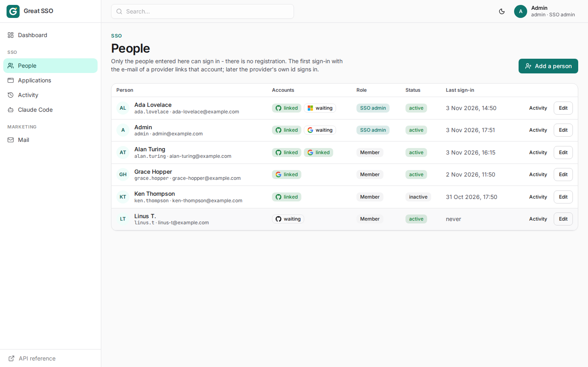
  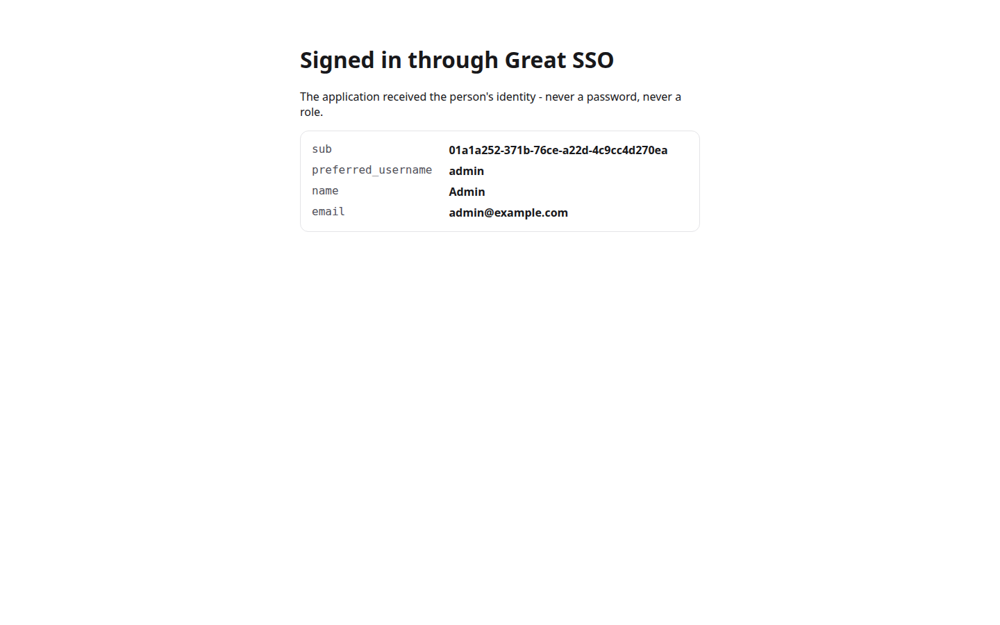
</p>

Applications add a **"Sign in with Great SSO"** button; Great SSO is their **OpenID Connect provider** and tells them who
the person is (`sub`, username, work e-mail) - roles stay in each application. People sign in with an account they
already have, and only if an admin entered them. The admins run it from a Blazor panel, through a REST API, or from
**Claude Code over MCP**.

## Why it is interesting

- **Its own narrow OpenID Connect provider**, built on the framework's JWT primitives only: authorization code + PKCE
  S256, exact redirect URIs, single-use codes, rotating refresh tokens with reuse detection, RFC 9207 `iss` - tested
  with ASP.NET Core's own handler and the OpenID Foundation's Basic OP plan. [ADR 0012](docs/adr/0012-own-narrow-openid-connect-provider.md)
- **No passwords and no registration**: GitHub, Google and work Microsoft accounts, linked on the first sign-in by the
  verified e-mail the admin entered, then by the provider's own id. [ADR 0011](docs/adr/0011-single-sign-on-through-external-providers.md)
- **Server-side sessions** (14 days idle, 30 at most) that end at once on deactivation, unlinking or an admin's click -
  and every API call re-reads the person. [ADR 0011](docs/adr/0011-single-sign-on-through-external-providers.md)
- **The EF Core model is the schema, Liquibase applies it**: migrations are exported to reviewable SQL changesets with
  rollbacks, no EF history table, no logic in the database - and a test fails when the model and the changesets drift.
  [ADR 0003](docs/adr/0003-ef-core-model-exported-to-liquibase.md)
- **Concurrency done properly**: `xmin` row versions (409 with a sentence, no locks held), row locks where two requests
  race for one code or token, an advisory lock for the seed. [ADR 0007](docs/adr/0007-optimistic-concurrency-with-xmin.md)
- **A transactional outbox on EF Core** relayed by a runner into Wolverine's durable outbox and RabbitMQ, with
  `FOR UPDATE SKIP LOCKED` between replicas. [ADR 0010](docs/adr/0010-runner-outbox-rabbitmq-wolverine.md)
- **MCP everywhere**: every panel operation is a Claude Code tool calling the same handler as the API, opened by an
  admin's personal token. [ADR 0013](docs/adr/0013-mcp-for-claude-code.md)
- **Modules as vertical slices** over one DbContext, three database roles that cannot change the schema, audit in the
  application, stable error codes - and the panel calls `/api` through a client generated from the OpenAPI document.
  [ADR 0005](docs/adr/0005-modules-as-boundaries-in-code.md), [ADR 0004](docs/adr/0004-three-database-roles.md),
  [ADR 0002](docs/adr/0002-one-host-blazor-calls-the-api.md)

## Screenshots

Made by [`e2e/screenshots.mjs`](e2e/screenshots.mjs) (Playwright) from the demo seed - the same walk is a smoke test.

| | |
|---|---|
| 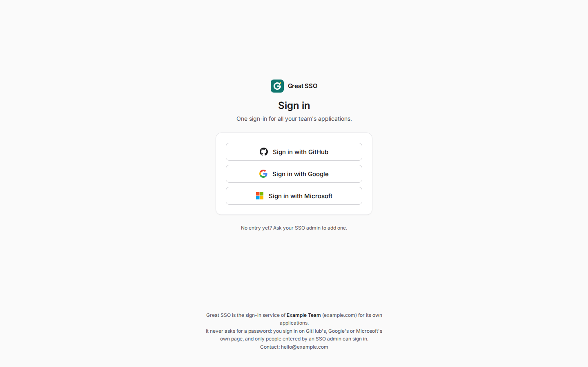<br>**Sign in** - only the providers the application accepts | 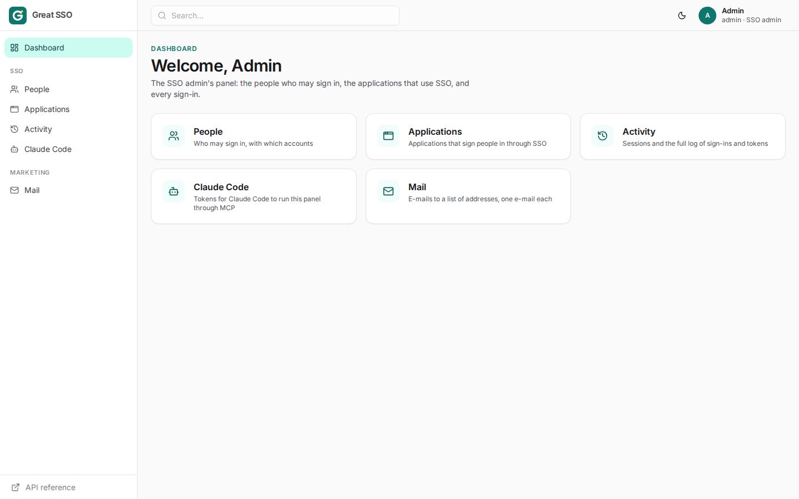<br>**Dashboard** |
| <br>**People** - entered by an admin, with their provider e-mails | 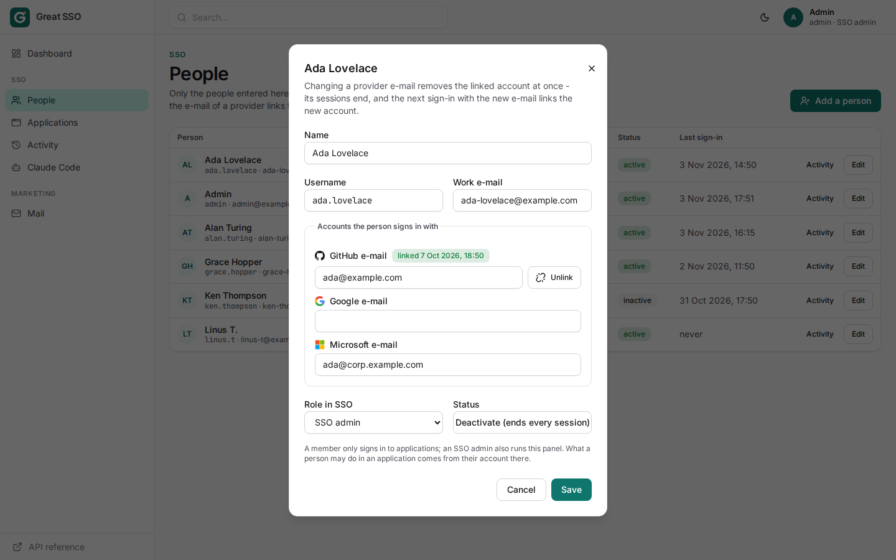<br>**A person** - linked accounts, unlink, deactivate |
| 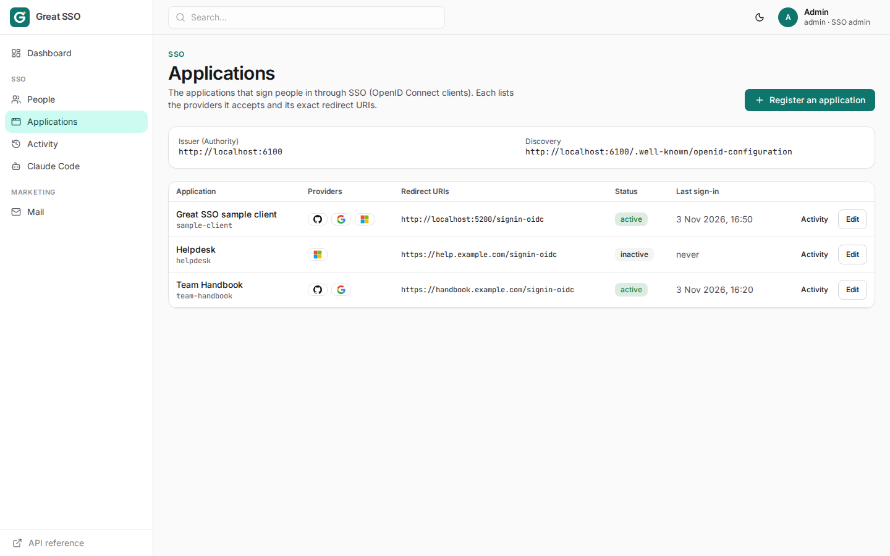<br>**Applications** - OpenID Connect clients | 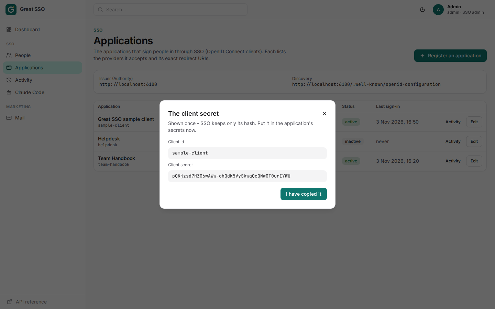<br>**A client secret** - shown once, stored as a hash |
| 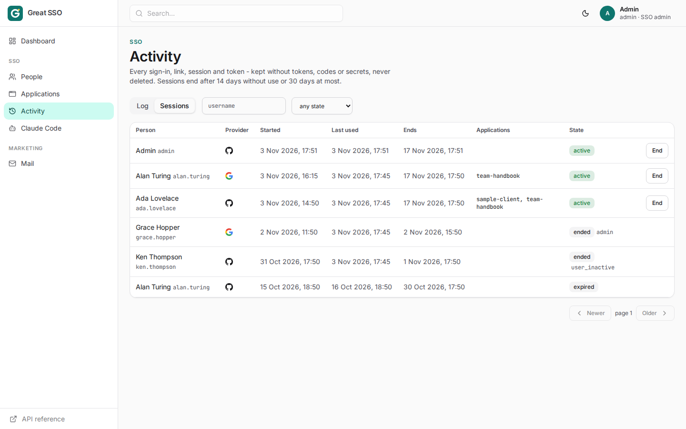<br>**Sessions** - active, ended, expired | 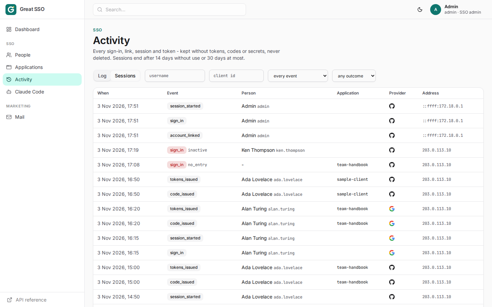<br>**The log** - every sign-in, refusal and token |
| 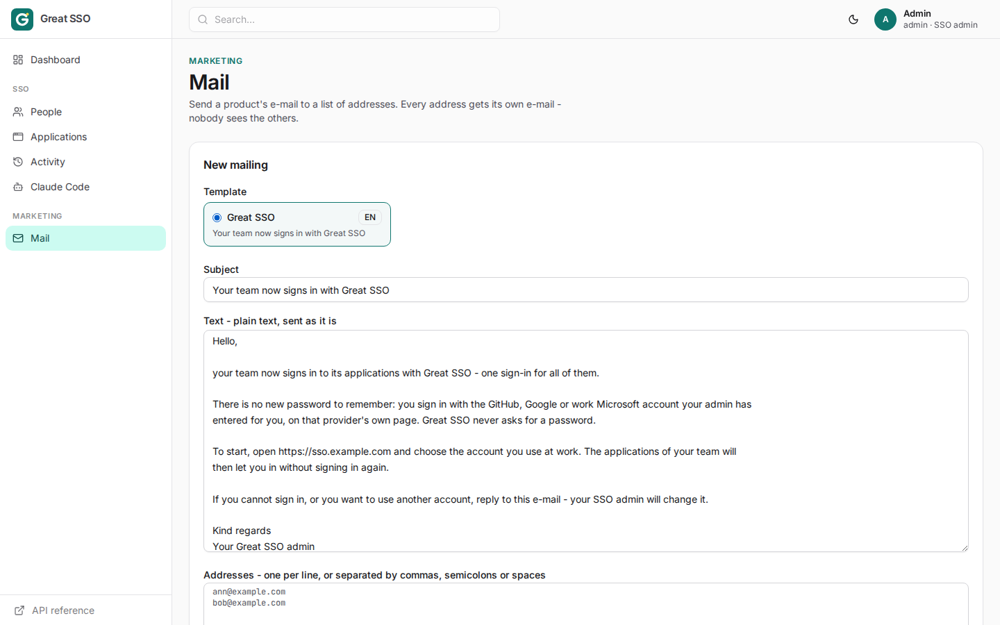<br>**Marketing** - a template | 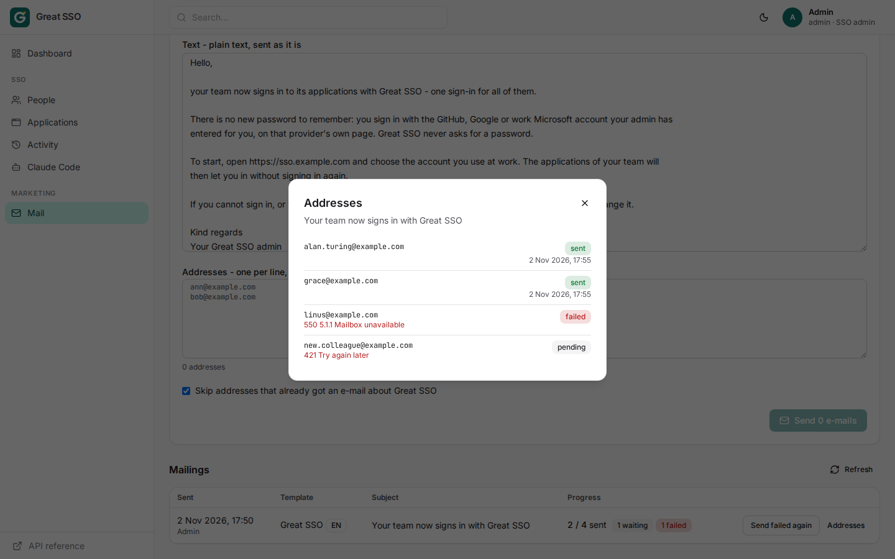<br>**A mailing** - one e-mail per address |
| 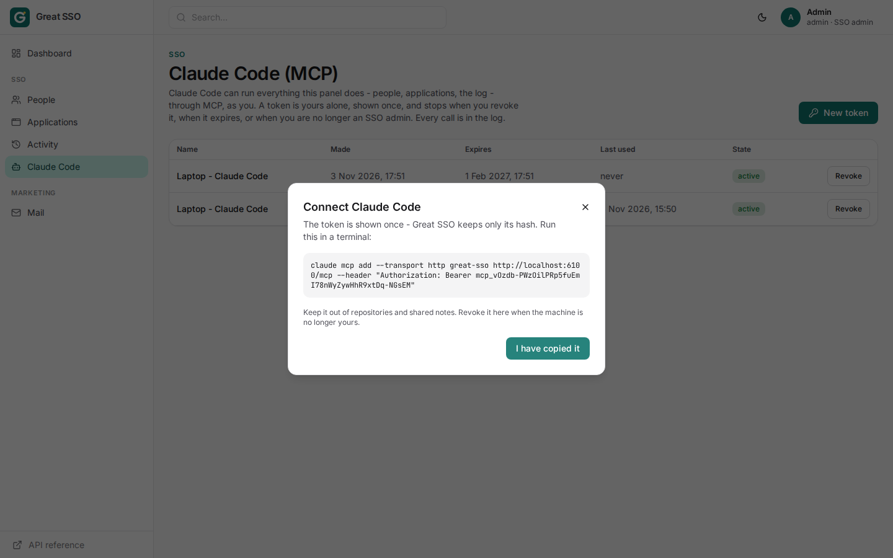<br>**Claude Code** - a token with its `claude mcp add` | 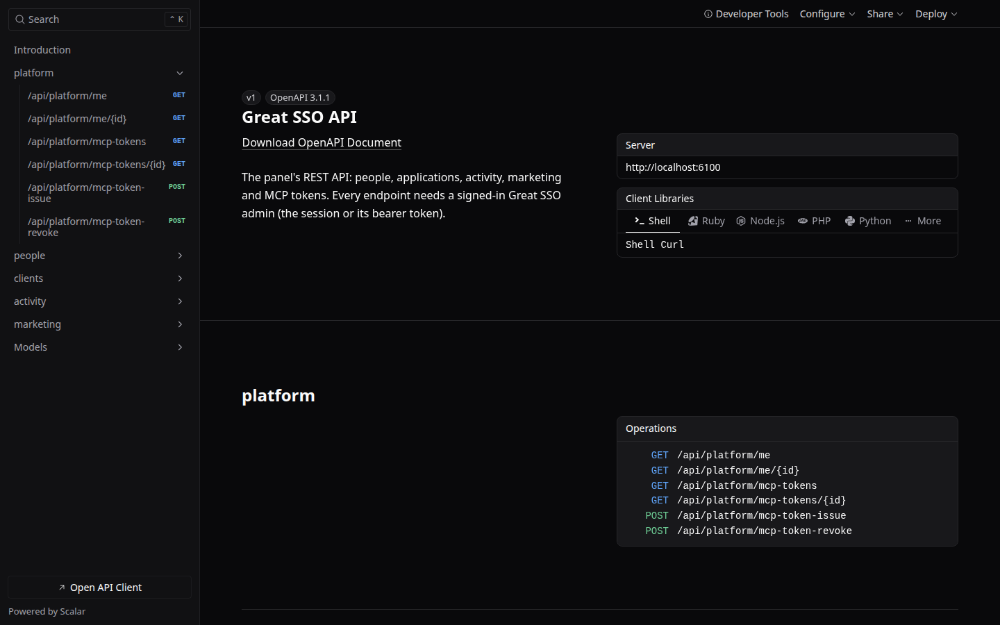<br>**API reference** (Scalar) |
| 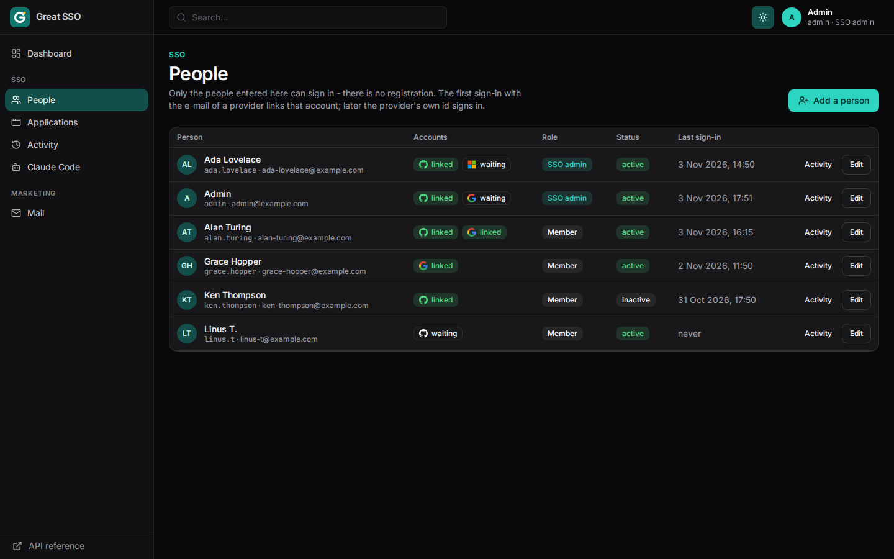<br>**Dark theme** | <br>**An application** signed in through Great SSO |
| 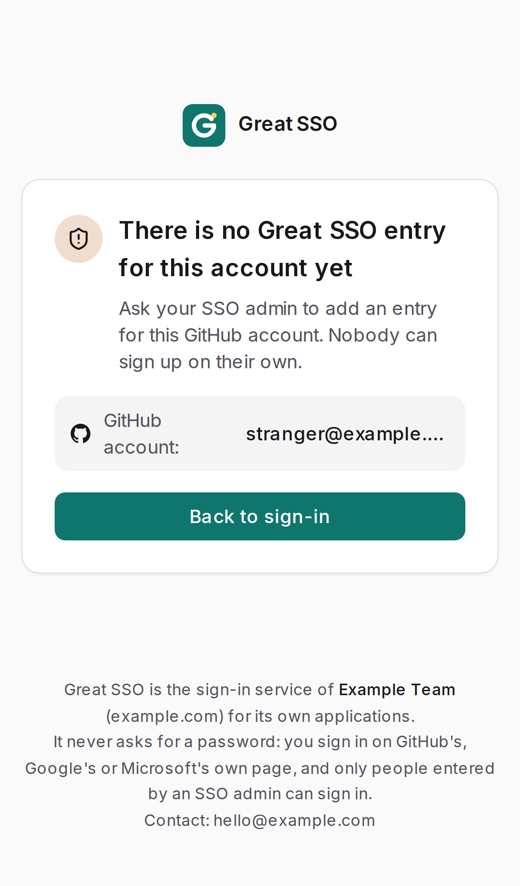<br>**A refused sign-in** on a phone | 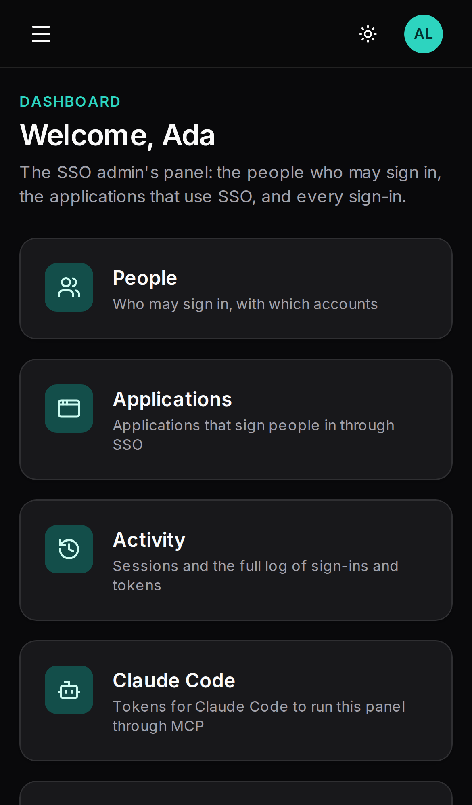<br>**The panel** on a phone, dark |

## Architecture

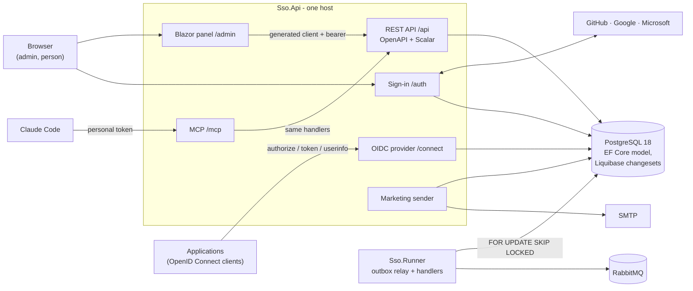
```mermaid
flowchart LR
  browser["Browser<br/>(admin, person)"]
  app["Applications<br/>(OpenID Connect clients)"]
  claude["Claude Code"]
  providers["GitHub · Google · Microsoft"]

  subgraph host["Sso.Api - one host"]
    blazor["Blazor panel /admin"]
    api["REST API /api<br/>OpenAPI + Scalar"]
    oidc["OIDC provider /connect"]
    signin["Sign-in /auth"]
    mcp["MCP /mcp"]
    sender["Marketing sender"]
  end

  runner["Sso.Runner<br/>outbox relay + handlers"]
  mq[("RabbitMQ")]
  pg[("PostgreSQL 18<br/>EF Core model,<br/>Liquibase changesets")]
  smtp["SMTP"]

  browser --> blazor
  browser --> signin
  blazor -- "generated client + bearer" --> api
  signin <--> providers
  app -- "authorize / token / userinfo" --> oidc
  claude -- "personal token" --> mcp
  mcp -- "same handlers" --> api
  api --> pg
  oidc --> pg
  signin --> pg
  sender --> pg
  sender --> smtp
  runner -- "FOR UPDATE SKIP LOCKED" --> pg
  runner --> mq
```

### Modules and their order

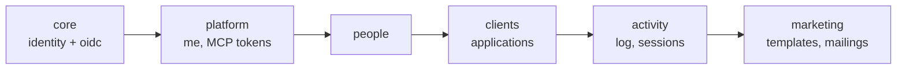
```mermaid
flowchart LR
  core["core<br/>identity + oidc"] --> platform["platform<br/>me, MCP tokens"] --> people["people"] --> clients["clients<br/>applications"] --> activity["activity<br/>log, sessions"] --> marketing["marketing<br/>templates, mailings"]
```

Each module is a folder of vertical slices in [`apps/Sso.Api/Features`](apps/Sso.Api/Features) over one `SsoDbContext`
([ADR 0005](docs/adr/0005-modules-as-boundaries-in-code.md)); tables in [`docs/domain.md`](docs/domain.md).

### Signing in to an application

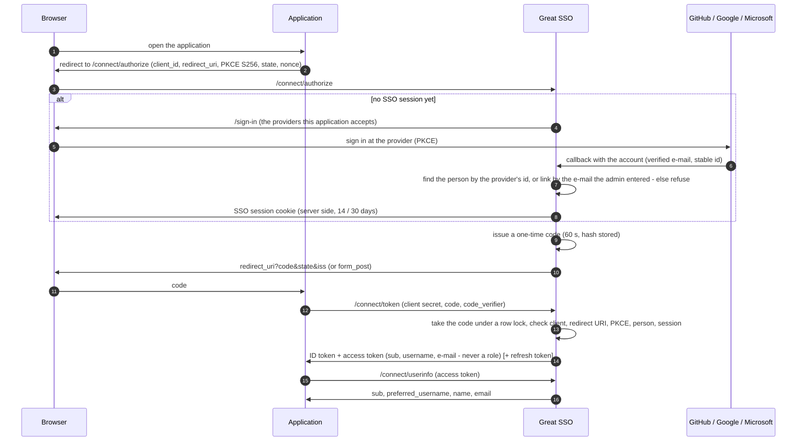
```mermaid
sequenceDiagram
  autonumber
  participant B as Browser
  participant A as Application
  participant S as Great SSO
  participant P as GitHub / Google / Microsoft
  B->>A: open the application
  A->>B: redirect to /connect/authorize (client_id, redirect_uri, PKCE S256, state, nonce)
  B->>S: /connect/authorize
  alt no SSO session yet
    S->>B: /sign-in (the providers this application accepts)
    B->>P: sign in at the provider (PKCE)
    P->>S: callback with the account (verified e-mail, stable id)
    S->>S: find the person by the provider's id, or link by the e-mail the admin entered - else refuse
    S->>B: SSO session cookie (server side, 14 / 30 days)
  end
  S->>S: issue a one-time code (60 s, hash stored)
  S->>B: redirect_uri?code&state&iss (or form_post)
  B->>A: code
  A->>S: /connect/token (client secret, code, code_verifier)
  S->>S: take the code under a row lock, check client, redirect URI, PKCE, person, session
  S->>A: ID token + access token (sub, username, e-mail - never a role) [+ refresh token]
  A->>S: /connect/userinfo (access token)
  S->>A: sub, preferred_username, name, email
```

### A session

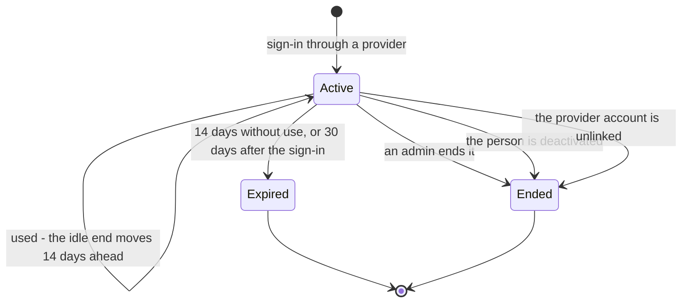
```mermaid
stateDiagram-v2
  [*] --> Active: sign-in through a provider
  Active --> Active: used - the idle end moves 14 days ahead
  Active --> Expired: 14 days without use, or 30 days after the sign-in
  Active --> Ended: an admin ends it
  Active --> Ended: the person is deactivated
  Active --> Ended: the provider account is unlinked
  Expired --> [*]
  Ended --> [*]
```

### Outbox, runner, RabbitMQ

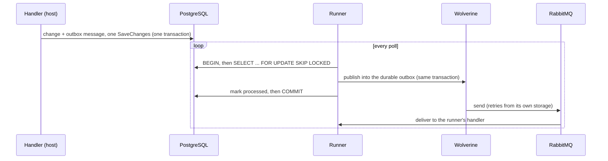
```mermaid
sequenceDiagram
  participant H as Handler (host)
  participant DB as PostgreSQL
  participant R as Runner
  participant W as Wolverine
  participant Q as RabbitMQ
  H->>DB: change + outbox message, one SaveChanges (one transaction)
  loop every poll
    R->>DB: BEGIN, then SELECT ... FOR UPDATE SKIP LOCKED
    R->>W: publish into the durable outbox (same transaction)
    R->>DB: mark processed, then COMMIT
    W->>Q: send (retries from its own storage)
    Q->>R: deliver to the runner's handler
  end
```

### A marketing mailing

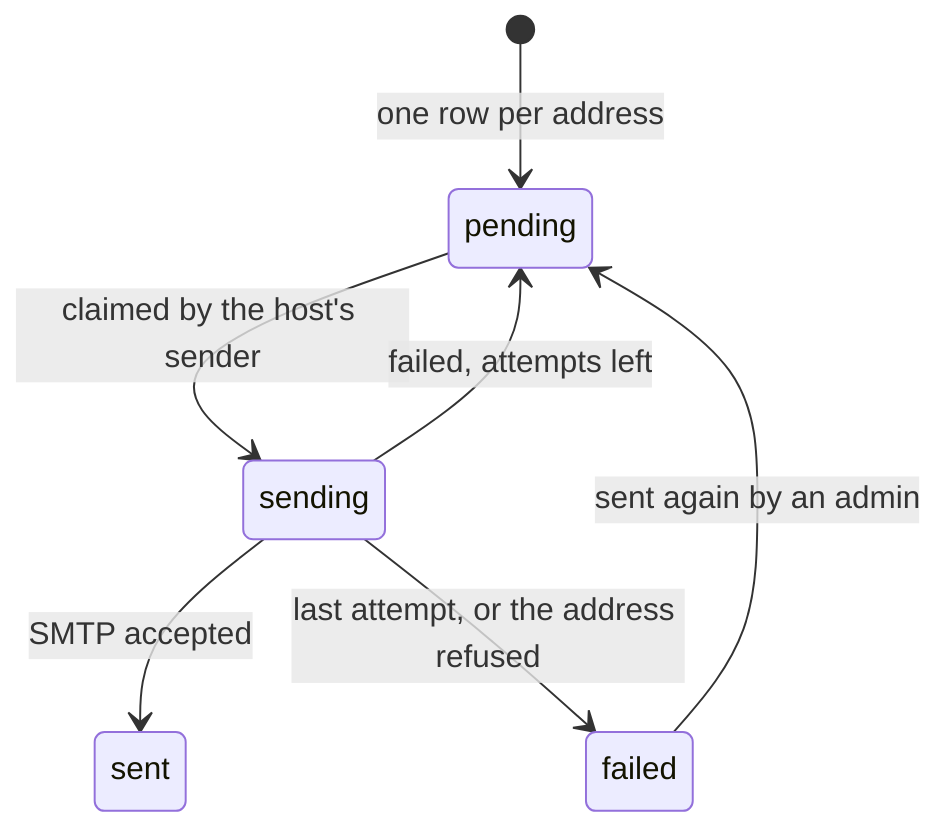
```mermaid
stateDiagram-v2
  [*] --> pending: one row per address
  pending --> sending: claimed by the host's sender
  sending --> sent: SMTP accepted
  sending --> pending: failed, attempts left
  sending --> failed: last attempt, or the address refused
  failed --> pending: sent again by an admin
```

### Deployment (Docker Swarm)

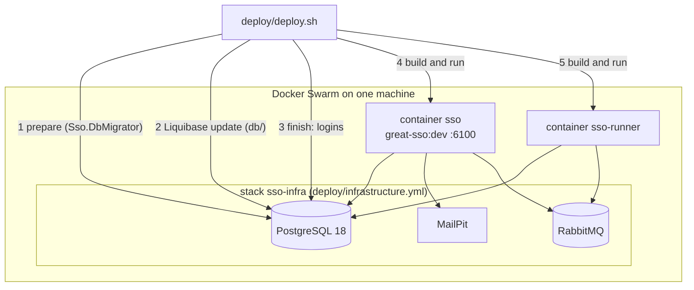
```mermaid
flowchart TB
  subgraph swarm["Docker Swarm on one machine"]
    subgraph infra["stack sso-infra (deploy/infrastructure.yml)"]
      pg[("PostgreSQL 18")]
      mq[("RabbitMQ")]
      mail["MailPit"]
    end
    host["container sso<br/>great-sso:dev :6100"]
    runner["container sso-runner"]
  end
  deploy["deploy/deploy.sh"] -->|"1 prepare (Sso.DbMigrator)"| pg
  deploy -->|"2 Liquibase update (db/)"| pg
  deploy -->|"3 finish: logins"| pg
  deploy -->|"4 build and run"| host
  deploy -->|"5 build and run"| runner
  host --> pg
  host --> mail
  host --> mq
  runner --> pg
  runner --> mq
```

## Stack

| Area | What |
|---|---|
| Host | .NET 10, ASP.NET Core minimal APIs (vertical slices), Blazor interactive server, Tailwind CSS v4 |
| Data | EF Core 10 + Npgsql on PostgreSQL 18; Liquibase 5 applies the changesets exported from the model |
| Protocol | own OpenID Connect provider on `Microsoft.IdentityModel.JsonWebTokens`; the framework's OAuth and OIDC handlers for GitHub, Google, Microsoft |
| API | OpenAPI (`Microsoft.AspNetCore.OpenApi`), Scalar, a Kiota client for the panel |
| Messaging | transactional outbox on EF Core, WolverineFx on RabbitMQ in the runner |
| Agents | `ModelContextProtocol.AspNetCore` - MCP for Claude Code |
| Tests | xUnit v3, Testcontainers (PostgreSQL 18 + Liquibase), WebApplicationFactory, Playwright |
| Ops | Docker Swarm, GitHub Actions images, Serilog, OpenTelemetry |

## Documentation

| Document | What is in it |
|---|---|
| [`PRODUCT.md`](PRODUCT.md) | goals with "Done when", non-goals, decisions, state |
| [`docs/domain.md`](docs/domain.md) | modules, tables (erDiagram), lifecycles |
| [`docs/design.md`](docs/design.md) | repository, a request, lists, error codes, roles |
| [`docs/integration.md`](docs/integration.md) | how an application adds "Sign in with Great SSO" |
| [`docs/runbooks/`](docs/runbooks/) | registering the GitHub and Google sign-in |
| [`docs/adr/`](docs/adr/) | 18 decisions, 0001-0018 |
| [`CLAUDE.md`](CLAUDE.md) | commands and rules for working in the repository |

## Run locally

Needs Docker and the .NET 10 SDK.

```bash
git clone <this repository> great-sso && cd great-sso
./deploy/deploy.sh          # infrastructure, database, Liquibase, host on http://localhost:6100 and the runner
```

The first start **seeds the first admin and the demo data** ([ADR 0015](docs/adr/0015-seed-on-start.md)): open
http://localhost:6100, choose GitHub - without provider ids in `.env` the **development sign-in stub** stands in for
the providers ([ADR 0018](docs/adr/0018-development-sign-in-stub-and-e2e.md)) - and continue as `admin@example.com`.
Everything is there: people, applications, sessions, the log, a mailing.

- Real providers: copy `.env.sample` to `.env`, fill in GitHub or Google ([runbooks](docs/runbooks/)), run
  `./deploy/deploy.sh` again.
- The first admin of a real deployment: `BootstrapAdmin__Email`, `BootstrapAdmin__GithubEmail`, ... in `.env` before
  the first start; `Seed__Demo=false` for no demo data.
- Working on the code: `./deploy/deploy.sh --db-only`, then `dotnet run --project apps/Sso.Api`.
- The sample application: `GreatSso__ClientSecret=<the secret from Applications → sample-client → New secret>
  dotnet run --project samples/Sso.SampleClient`, then http://localhost:5200.

## Tests

```bash
./verify schema     # the database = the EF model, no logic in the database, roles
./verify oidc       # the OpenID Connect provider, rule by rule
./verify all        # every group (needs Docker)
```

Groups: `schema`, `platform`, `web`, `sign-in`, `sessions`, `people`, `clients`, `activity`, `marketing`, `oidc`,
`mcp`, `outbox`, `seed`. Every test runs against PostgreSQL 18 in a container with the schema Liquibase builds from
`db/` - the same changesets as a deployment. The OpenID Foundation's Basic OP plan runs from
[`tools/conformance/`](tools/conformance/).

## End-to-end screenshots

```bash
./deploy/deploy.sh                       # on an empty database: the demo seed is what the screenshots show
cd e2e && npm install && npx playwright install chromium && npm run screenshots
```

The walk signs in through the development stub, goes through every page, registers a secret for the sample client,
starts `samples/Sso.SampleClient` with it and signs in there - writing `docs/screenshots/NN-name.png`. A step that fails
fails the run.

## Migrations (EF Core → Liquibase)

```bash
# 1. change the model in libs/Sso.Data
dotnet tool run dotnet-ef migrations add AddSomething --project libs/Sso.Data --startup-project libs/Sso.Data --output-dir Migrations
# 2. export it as a changeset (with its rollback, without EF's history table)
db/scripts/export-ef-migration.sh AddSomething people-add-something
# 3. apply
./deploy/deploy.sh --db-only
```

`./verify schema` fails when the model has a change without a migration or a migration without its changeset
([ADR 0003](docs/adr/0003-ef-core-model-exported-to-liquibase.md)).

## Deploy

[`deploy/deploy.sh`](deploy/deploy.sh) deploys on Docker Swarm: the infrastructure stack
([`deploy/infrastructure.yml`](deploy/infrastructure.yml) - PostgreSQL 18, RabbitMQ, MailPit), the migrator role and
database, Liquibase, the application roles, then the host and the runner ([ADR 0017](docs/adr/0017-deployment-on-docker-swarm.md)).
Names and ports are parameters (`SSO_STACK`, `SSO_NETWORK`, `SSO_PORT`, ...). Images for a registry are built from
tags `v-api-<n>`, `v-db-<n>`, `v-migrator-<n>` by GitHub Actions and pushed to `vars.IMAGE_REGISTRY`
(default `ghcr.io/<owner>`).

## MCP for Claude Code

In the panel, **Claude Code → New token**; run the command it shows once:

```bash
claude mcp add --transport http great-sso https://sso.example.com/mcp --header "Authorization: Bearer mcp_..."
```

Every panel operation is a tool (`people_list`, `person_add`, `client_register`, `events_list`, `mail_send`, ...),
calling the same handlers as the API, as the token's admin; every call is logged
([ADR 0013](docs/adr/0013-mcp-for-claude-code.md)).

## How it was built

The project was commissioned, designed and led by a tech lead <!-- tech lead: name and link --> - the specification,
the architecture decisions (ADRs), the review and the acceptance of every stage. The code, the tests and the
documentation were written by [Claude Code](https://claude.com/claude-code).

The work went spec first: the tech lead wrote the goal and the rules of a stage, the decisions became ADRs before the
code, every rule got a test as its proof (written together with the code, run as a separate test phase), and the
end-to-end walk with its screenshots closed each stage. The version you see started as a modular monolith with its
logic in PostgreSQL and was moved, rule by rule, to EF Core with the database as plain storage - the tests kept the
behaviour the same.

## License

[MIT](LICENSE) - Copyright (c) 2026 Great SSO contributors.
